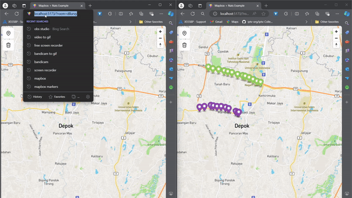

## About



Ekperimen integrasi mapbox dengan NATs

Referensi:
[https://www.youtube.com/watch?v=As5FojxWViI](https://www.youtube.com/watch?v=As5FojxWViI)

## Techstack

- [x] Mapbox
- [x] Nats
- [x] Vite 
- [x] React

## How to run

1. Install NATS cli and NATS server  
2. Clone this repo

```sh
git clone https://github.com/nekoding/mapbox-nats.git
```
  
3. Install dependency using bun / npm / pnpm

```sh
bun install
```
  
4. Run Nats Server
  
```sh
nats-server -c nats.conf
```

5. Change MAPBOX API Key in `App.jsx`
  
6. Run web app 

```sh
bun run dev
```
  
7. Setup jetstream (optional)

```sh
nats s add [name] --no-deny-purge --allow-rollup
# Make sure the subject name is set to `maps.*` so jetstream can catch all subject from map
```